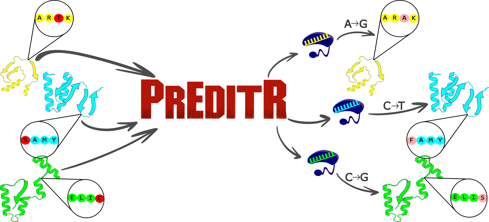

# PrEditR Documentation

> **How organism data works.** The PrEditR application image ships without any
> genome/annotation data. Organism reference data is supplied *externally* and
> discovered at runtime. You can supply it two ways — a **prebuilt reference image**
> from Docker Hub, or a **custom payload folder** you build yourself — and both the
> Shiny app and the CLI consume either one identically. See
> [Organism Reference Data](#organism-reference-data) for the full model.

## Table of Contents
- [About PrEditR](#about-preditr)
- [Understanding the Input](#understanding-the-input)
  - [Command-line arguments](#command-line-arguments)
  - [Defining Your Base Editors](#defining-your-base-editors)
  - [Defining Your Targets](#defining-your-targets)
- [Understanding the Output](#understanding-the-output)
- [Organism Reference Data](#organism-reference-data)
  - [Why references are external](#why-references-are-external)
  - [What a reference contains](#what-a-reference-contains)
  - [Two ways to supply a reference](#two-ways-to-supply-a-reference)
  - [Getting prebuilt reference images](#getting-prebuilt-reference-images)
  - [Building a custom reference (payload folder)](#building-a-custom-reference-payload-folder)
  - [How the app finds references](#how-the-app-finds-references)
- [Running the Shiny App (Docker Desktop)](#running-the-shiny-app-docker-desktop)
  - [1. Which version to download](#1-which-version-to-download)
  - [2. Option A — Docker Compose (recommended)](#2-option-a--docker-compose-recommended)
  - [3. Option B — Docker Desktop GUI walkthrough (no terminal)](#3-option-b--docker-desktop-gui-walkthrough-no-terminal)
  - [4. Accessing and using PrEditR](#4-accessing-and-using-preditr)
  - [5. Managing PrEditR Containers](#5-managing-preditr-containers)
- [Running in Command Line Mode](#running-in-command-line-mode)
  - [CLI via Docker Compose](#cli-via-docker-compose)
  - [CLI via `docker run` + a payload folder](#cli-via-docker-run--a-payload-folder)
  - [CLI via Singularity / Apptainer (HPC)](#cli-via-singularity--apptainer-hpc)
  - [Listing installed organisms](#listing-installed-organisms)
- [Limitations](#limitations)
- [Reporting Issues](#reporting-issues)

---

## About PrEditR



PrEditR was developed by the [Myers Lab](https://www.samyerslab.org) at [La Jolla Institute for Immunology](https://www.lji.org) to support CRISPR sgRNA design using custom base editors. Originally created to streamline large-scale sgRNA design for protein post-translational modifications (PTMs) functional screens, PrEditR is a user-friendly tool for protein-centric base editing applications.

It runs both as a **Shiny web application** (aimed at non-computational users through Docker Desktop) and as a **command-line batch tool**. Both modes share the same guide-design pipeline and the same organism-reference model described below.

---

## Understanding the Input

### Command-line arguments

The complete set of CLI flags is below. The Shiny app exposes the same options as
form fields, so this table is the single reference for both modes. Paths passed to the
CLI are paths **inside the container** — bind/mount them as shown in
[Running in Command Line Mode](#running-in-command-line-mode).

| Argument | Required? | Default | Description |
| :--- | :--- | :--- | :--- |
| `--input` | Yes | — | Path to the targets CSV (see [Defining Your Targets](#defining-your-targets)). |
| `--editors` | Yes | — | Path to the editors CSV (see [Defining Your Base Editors](#defining-your-base-editors)). |
| `--output` | Yes | — | Output directory. **Must already exist.** |
| `--tmp` | Yes | — | Scratch directory for the run. **Must already exist**; its contents are cleared on exit. |
| `--organism` | Yes* | — | Organism id of an installed reference (`human`, `mouse`, …). *Optional when `--reference` is given — the id is then read from the payload's manifest. See [How the app finds references](#how-the-app-finds-references). |
| `--reference` | No | — | Path to a **single** organism's payload directory (the folder that directly contains `preditr_reference.json`). One-shot alternative to `--references_path` + `--organism`; the directory name must equal the organism id. A plain filesystem path, so it behaves identically under Docker and Singularity. |
| `--references_path` | No | `/refs` | Base directory holding per-organism references. Overrides the `PREDITR_REFERENCES_PATH` environment variable. |
| `--job_name` | No | `PrEditR_job` | Name used in output filenames. Letters, numbers, and `( ) . _` only. |
| `--threads` | No | `4` | Number of parallel workers. Budget ~1.5 GB RAM baseline + ~1.5 GB per additional thread. |
| `--off_targets` | No | `FALSE` | `TRUE` enables the off-target search (requires `--indexed_genome`). |
| `--indexed_genome` | If `--off_targets TRUE` | — | Folder of Bowtie `.ebwt` index files for the organism's genome. |
| `--n_mismatches` | No | `3` | Maximum mismatches when searching for off-targets (max 10). |
| `--n_max_alignments` | No | `3` | Discard guides with more than this many exact (0-mismatch) genomic alignments. |
| `--non_editing_controls` | No | `FALSE` | `TRUE` also returns, per gene, guides whose edit window makes no edit. |
| `--dna_context` | No | `FALSE` | `TRUE` appends `dna_context_upstream`, `dna_edit_window`, and `dna_context_downstream` to the output. |
| `--flanking5` / `--flanking3` | No | `""` | 5'/3' sequence appended to each spacer when screening for restriction sites (EcoRI, KpnI, BsmBI, BsaI, BbsI, PacI). |
| `--list_organisms` | No | — | Print the organisms installed under the references path and exit. |

### Defining Your Base Editors

| Column Name | Description | Example |
| :--- | :--- | :--- |
| **name** | A unique name for the editor, used to link to targets. | `ABE8e` |
| **pam_sequence** | The Protospacer Adjacent Motif (PAM) sequence. Use 'N' for any nucleotide. | `NGG` |
| **spacer_length** | The length (in nucleotides) of the guide RNA's spacer sequence. | `20` |
| **edit_type** | The specific base conversion the editor performs (e.g., `a2g`, `c2t`). | `a2g` |
| **edit_window_min** | The start of the editing window; closest position to the PAM (must be negative). | `-13` |
| **edit_window_max** | The end of the editing window; furthest position from the PAM (must be negative). | `-17` |

See `www/editors_example.csv` for a reference file. The Direct Input tab of the Shiny app also uses this file as its editor catalog.

### Defining Your Targets

**Note:** At least one of **gene symbol**, **Ensembl transcript ID**, or **UniProt ID** is **REQUIRED** per target — any one is sufficient. When more than one is given, the Ensembl transcript ID takes precedence over the UniProt ID, which takes precedence over the gene symbol. A gene symbol on its own resolves to the gene's canonical transcript. Gene-symbol and UniProt-ID input depend on the selected organism's reference including the corresponding ID maps (all curated references include them; a custom FASTA/GFF reference built without those maps accepts Ensembl/transcript IDs only — see [Building a custom reference](#building-a-custom-reference-payload-folder)).

| Column Name | Description |
| :--- | :--- |
| **gene_symbol** | The official symbol for the target gene (e.g., `KRAS`). Sufficient on its own; resolves to the canonical transcript. |
| **ensembl_id** | The Ensembl transcript ID (e.g., `ENST00000256078`). Highly recommended for isoform precision. |
| **uniprot_id** | The UniProt Accession ID (e.g., `P01116`). |
| **target_aa** | The single-letter code for the target amino acid (e.g., `V`). |
| **target_position** | The numerical position of the target amino acid within the protein sequence. |
| **editor** | The name of the editor for this target (must match `name` in the editors file). |
| **edit_type** | The type of edit (must match the `edit_type` defined for the chosen editor). |

See `www/targets_example.csv` for a reference file.

---

## Understanding the Output

PrEditR appends the following columns to the input:

| Column Header | Explanation |
| :--- | :--- |
| `gene_strand` | Indicates the strand where the gene is located, either **+** or **-**. |
| `protospacer_seq` | The specific DNA sequence that the guide RNA is designed to bind to. |
| `percent_gc` | The percentage of G and C bases within the protospacer sequence. |
| `protospacer_strand` | The strand of the DNA (**+** or **-**) that the protospacer sequence is on. |
| `pam_seq` | The Protospacer Adjacent Motif (PAM) sequence. |
| `chromosome` | The chromosome where the target sequence is located. |
| `pam_coordinates_start` | Genomic start coordinate (lower position) of the PAM sequence. |
| `pam_coordinates_end` | Genomic end coordinate (higher position) of the PAM sequence. |
| `protospacer_coordinates_start` | Genomic start coordinate (lower position) of the protospacer. |
| `protospacer_coordinates_end` | Genomic end coordinate (higher position) of the protospacer. |
| `polyA`, `polyC`, `polyG`, `polyT` | `TRUE` if the protospacer contains a homopolymer run (≥4 nt) of the given base. A `polyT` run is a Pol III terminator that can truncate U6-driven sgRNA transcription. |
| `startingGGGGG` | `TRUE` if the protospacer begins with a run of five G's (`GGGGG`). |
| `dna_context_upstream`, `dna_edit_window`, `dna_context_downstream` | Only present when `--dna_context TRUE`. Raw genomic DNA sequence of the edit window and the 50 nt immediately upstream/downstream of it, in the sgRNA's own 5'->3' orientation. |
| `mutation_type` | Classification of the intended mutation (e.g., missense, nonsense, silent). |
| `wildtype_sequence` | Original amino acid sequence (+/- 7 AA). Target sites are identified by vertical bars. |
| `mutant_sequence` | Resulting mutant amino acid sequence after the intended edit (+/- 7 AA). |
| `edit` | Concise summary of the amino acid change (e.g., **S45P**). |
| `Restriction Enzymes` | Checks for recognition sites of **EcoRI, KpnI, BsmBI, BsaI, BbsI, PacI, MluI**. |
| `Off-Target Alignments` | Quantifies specificity via `alignments_n0` through `alignments_n3`. |
| `error` | Provides detailed reasons for rows that failed to generate a guide. |
| `warning` | Provides non-fatal warnings regarding the design or database mapping. |

---

## Organism Reference Data

This is the core model behind PrEditR's data. Read it once and the rest of the
Shiny/CLI instructions will make sense.

### Why references are external

The PrEditR application image contains only the guide-design software — no
genome or annotation data. This keeps the image lean and lets you add organisms
without touching the app. PrEditR reads organism data at runtime from a
**references directory** (default `/refs`, configurable via the
`PREDITR_REFERENCES_PATH` environment variable or the CLI `--references_path` flag).

Each organism lives in its own subdirectory, and the app **discovers** what is
installed by scanning for manifest files — you don't recompile or reconfigure the app
to add an organism, you just make its reference available under the references
directory.

### What a reference contains

One organism's reference is a self-contained directory:

```text
<references_path>/<organism_id>/
  preditr_reference.json     # discovery manifest (organism id, genome build, packages, …)
  rlib/                      # the organism's R packages (e.g. the BSgenome genome package)
  annotation/
    txdb.rds                 # normalized annotation (a crisprDesignData-style GRangesList)
  maps/                      # ID maps (uniprot<->ensembl, isoform flags, AlphaFold pLDDT, …)
```

The `preditr_reference.json` manifest is the key file — its presence is what marks a
directory as an installed organism. It records the `organism_id` (what you pass to
`--organism` / pick in the dropdown), the human-readable `organism_label` (what the
dropdown shows), the `genome_build`, and the Bioconductor version the reference was
built for. The reference's Bioconductor version must match the application image's;
PrEditR checks this at load time and fails loudly on a mismatch rather than crashing
deep in the pipeline.

### Two ways to supply a reference

Both produce the **same** per-organism files above and are consumed identically by the
app and CLI. Choose based on how you obtained the organism and how widely you need to
distribute it:

| | **Reference image** | **Payload folder** |
| :--- | :--- | :--- |
| **What it is** | A Docker image `fvasquezcastro/preditr-ref:<organism>-<genome>` that wraps the reference directory | The same reference directory as plain files on disk |
| **How it reaches the app** | A one-shot initializer container copies its payload into a shared `/refs` volume, then exits | You mount/point the app at the folder directly via `PREDITR_REFERENCES_PATH` |
| **Best for** | Distributing curated organisms to many users through `docker compose up` | A single machine or lab, or custom organisms you built yourself |
| **How you get it** | `docker pull` from Docker Hub (curated organisms) | Build it with the `ref-builder` image, or unpack a reference image |

You can freely mix them: the references directory can contain some organisms populated
by reference images and others dropped in as payload folders. The app discovers all of
them the same way.

### Getting prebuilt reference images

Curated reference images are published on Docker Hub under
[`fvasquezcastro/preditr-ref`](https://hub.docker.com/r/fvasquezcastro/preditr-ref).
The image tag encodes the organism and genome build:

```text
fvasquezcastro/preditr-ref:human-grch38        # human, GRCh38
fvasquezcastro/preditr-ref:mouse-mm10          # mouse, mm10
fvasquezcastro/preditr-ref:yeast-saccer3       # yeast, sacCer3
fvasquezcastro/preditr-ref:rat-rn7             # rat, rn7
fvasquezcastro/preditr-ref:zebrafish-danrer11  # zebrafish, danRer11
fvasquezcastro/preditr-ref:fruitfly-dm6        # fruit fly, dm6
fvasquezcastro/preditr-ref:celegans-ce11       # C. elegans, ce11
fvasquezcastro/preditr-ref:chicken-galgal6     # chicken, galGal6
```

These eight organisms are enabled in the reference registry
(`run/reference_organisms.tsv`); additional organisms can be built and published
from that registry (see below). Reference images are currently built for
`linux/amd64`; on Apple Silicon they run under Docker Desktop's emulation.

With Docker Compose you normally **don't pull these by hand** — the Compose
generator wires the reference images it finds and Docker pulls anything still
missing on first `up` (see
[Option A — Docker Compose](#2-option-a--docker-compose-recommended)). By default
the generator only wires organisms whose image is already present locally
(`docker image ls`), so pull the ones you want first, or pass `--no-filter` to
wire every enabled organism and let `up` pull them.

### Building a custom reference (payload folder)

For an organism that isn't published — or your own genome build — you can build a
reference from a genome **FASTA** plus an annotation **GFF3/GTF** (and an optional
UniProt↔transcript map to enable UniProt-ID input). The easiest path is the prebuilt
**reference-builder image**, which bakes in the whole R/Bioconductor toolchain so a
build is a single `docker run` that outputs a payload folder:

```sh
docker run --rm -u "$(id -u):$(id -g)" \
  -v /path/to/inputs:/in:ro \
  -v "$PWD/refs":/out \
  fvasquezcastro/preditr-ref:ref-builder \
  --organism newt --label "Newt" --genome-build newt1 \
  --genome-fasta   /in/newt.fa \
  --annotation-gff /in/newt.gff3 \
  --uniprot-map    /in/newt_uniprot.tsv     # optional; omit to build without UniProt-ID input
```

This writes `./refs/newt/` — a ready-to-use payload folder. Point the app at the base
directory that contains it (`PREDITR_REFERENCES_PATH="$PWD/refs"`) and `newt` will
appear as an installed organism. `-u "$(id -u):$(id -g)"` keeps the output files
host-owned; mount inputs read-only (`:ro`) and the output directory read-write.

Run the builder with `--help` for all options (`--annotation-format`,
`--genome-organism`, `--provider`, `--standard-chrom-only`, `--out`, …):

```sh
docker run --rm fvasquezcastro/preditr-ref:ref-builder --help
```

> **Full build documentation lives in the [`preditr_ref`](https://github.com/fvasquezcastro/preditr_ref) repo.**
> That repo builds and publishes both the per-organism reference images and the
> `ref-builder` image, and documents the payload contract, the UniProt map TSV format,
> the organism registry (`reference_organisms.tsv`), and how to package a payload
> folder into a distributable reference image. This app repo only *consumes* references.

### How the app finds references

At startup (Shiny) and at job dispatch (CLI), PrEditR scans the references directory
for `*/preditr_reference.json` and treats each match as an installed organism:

- **Precedence for the base directory:** explicit `--references_path` argument →
  `PREDITR_REFERENCES_PATH` environment variable → `/refs` (default).
- **Shiny:** the organism dropdowns (Direct Input and Batch Search tabs) are
  populated automatically from the discovered manifests — the label shown is the
  manifest's `organism_label`, and selecting it passes the `organism_id` to the
  pipeline. If nothing is discovered, the app falls back to its static choices.
- **CLI:** pass the `organism_id` to `--organism`. Use `--list_organisms` to print
  what is installed (see [Listing installed organisms](#listing-installed-organisms)).

---

## Running the Shiny App (Docker Desktop)

The Shiny app is the recommended path for non-computational users. There are two ways
to launch it: **Docker Compose** (recommended — it wires up references for you) and the
**Docker Desktop GUI** (manual, more clicking but no terminal required).

### 1. Which version to download

PrEditR comes in two builds — pick the one that matches your computer's processor:

* **`amd64`** — Intel or AMD processors (most Windows PCs, older Macs).
* **`arm64`** — Apple M-series chips (M1/M2/M3/M4) and Snapdragon.

You'll use this later as the *tag* when you download the app, e.g.
`1.9.0_amd64` or `1.9.0_arm64`. If you're not sure which you have, `amd64` will
still run on Apple Silicon (just a little slower).

### 2. Option A — Docker Compose (recommended)

Compose starts the reference initializer containers (which populate a shared `/refs`
volume) **and** the Shiny app, in the right order, with one command. This repo ships a
ready-to-use Compose file at `run/compose.yaml`.

1. **Install Docker Desktop** from the official [Docker website](https://www.docker.com/products/docker-desktop/).
2. **Start the stack** from the repository root:

   ```sh
   docker compose -f run/compose.yaml up
   ```

   or use the convenience wrapper (creates the local output directory first):

   ```sh
   run/run_preditr_compose.sh
   ```

   On first run, Docker pulls the application image and the reference images wired
   into the Compose file (by default, the enabled organisms whose images you have
   already pulled locally), the reference containers copy their payloads into the
   shared `preditr_refs` volume and exit, then the Shiny container starts.
3. **Open** [http://localhost:3838](http://localhost:3838).
4. **Results** written inside the container at `/outputs` appear on the host under
   `run/preditr_outputs/`.

**Which organisms appear?** Whatever the Compose file installs. To change the set,
edit the organism registry and regenerate the file:

```sh
# reference_organisms.tsv lists organisms and image tags; enabled=true rows are considered.
# By default only enabled organisms whose image is already pulled locally are wired.
run/generate_reference_compose.sh              # regenerate run/compose.yaml (filter by pulled images)
run/generate_reference_compose.sh --no-filter  # wire every enabled organism; up will pull them
```

To populate a references directory **without** Compose (e.g. on HPC, or to prepare a
payload folder), use the runtime-agnostic staging helper, which works with Docker
**and** Singularity/Apptainer:

```sh
run/sync_references.sh --all                       # stage every enabled organism
run/sync_references.sh human mouse yeast           # just these
run/sync_references.sh --runtime singularity --refs-dir /scratch/$USER/refs --all
```

**Adding a custom payload folder to the Compose stack.** If you built a reference with
the `ref-builder` image (see [Building a custom reference](#building-a-custom-reference-payload-folder)),
mount its parent directory into the Shiny container alongside the shared volume. Add a
bind mount to the `preditr-shiny` service in `run/compose.yaml`, for example:

```yaml
  preditr-shiny:
    image: fvasquezcastro/preditr:1.9.0_amd64
    ports:
      - "3838:3838"
    volumes:
      - preditr_refs:/refs           # curated organisms from reference images
      - ./my_refs/newt:/refs/newt    # your custom payload folder -> discovered as "newt"
      - ./preditr_outputs:/outputs
    environment:
      PREDITR_REFERENCES_PATH: /refs
```

The custom organism then shows up in the dropdown next to the curated ones.

### 3. Option B — Docker Desktop GUI walkthrough (no terminal)

This is the click-only path. You don't need to understand how Docker works — just
follow the steps and copy the values into the fields exactly as shown.

Two ideas make the rest easy:

* You download two things: the **app** (`fvasquezcastro/preditr`) and at least one
  **organism** (`fvasquezcastro/preditr-ref`, e.g. human). The app has the software;
  the organism has the genome data it needs.
* You make **two folders** on your computer — one for the organism data (`refs`) and
  one for your results (`outputs`) — and tell each container to use them.

#### Step 1 — Install Docker Desktop and make two folders

1. Install **Docker Desktop** from the [Docker website](https://www.docker.com/products/docker-desktop/)
   and open it.
2. On your computer, create a folder called `preditr` with two empty folders inside:
   `refs` and `outputs`. For example:
   * macOS/Linux: `~/preditr/refs` and `~/preditr/outputs`
   * Windows: `C:\preditr\refs` and `C:\preditr\outputs`

   Remember the full path to each — you'll paste them into fields below.

#### Step 2 — Download the app and an organism

In the Docker Desktop **search bar** at the top, search for and pull each of these:

| Search for | Pick the tag | What it is |
| :--- | :--- | :--- |
| `fvasquezcastro/preditr` | `1.9.0_amd64` or `1.9.0_arm64` ([which one?](#1-which-version-to-download)) | The PrEditR app |
| `fvasquezcastro/preditr-ref` | `human-grch38` (or another organism from [the list](#getting-prebuilt-reference-images)) | The organism's genome data |

To pull: type the name, click the result, choose the tag from the **Tag** dropdown,
and click **Pull**. Repeat the organism download for every organism you want.

#### Step 3 — Load the organism data into your `refs` folder

The organism download is a small helper that copies its data into your `refs`
folder and then stops by itself. Run it once per organism:

1. Go to the **Images** tab and click **Run** on the `fvasquezcastro/preditr-ref` image.
2. Click **Optional settings** and fill in one **Volume**:

   | Field | Value |
   | :--- | :--- |
   | Host path | your `refs` folder, e.g. `~/preditr/refs` |
   | Container path | `/refs` |

3. Click **Run**. It runs for a moment and stops on its own — **that's normal.** Your
   `refs` folder now contains the organism (e.g. a `human` subfolder). Repeat for each
   organism you downloaded.

#### Step 4 — Start the PrEditR app

1. Go to the **Images** tab and click **Run** on the `fvasquezcastro/preditr` image.
2. Click **Optional settings** and fill in these fields:

   **Ports**

   | Field | Value |
   | :--- | :--- |
   | Host port | `3838` |

   **Volumes** (click **+** to add a second row)

   | Host path | Container path |
   | :--- | :--- |
   | your `refs` folder, e.g. `~/preditr/refs` | `/refs` |
   | your `outputs` folder, e.g. `~/preditr/outputs` | `/outputs` |

   **Environment variables** (click **+** to add a second row)

   | Variable | Value |
   | :--- | :--- |
   | `PREDITR_REFERENCES_PATH` | `/refs` |
   | `PREDITR_OUTPUTS_PATH` | `/outputs` |

3. Click the blue **Run** button.

#### Step 5 — Open PrEditR

Open your web browser to **[http://127.0.0.1:3838](http://127.0.0.1:3838)**. The
organisms you loaded in Step 3 appear in the **Organism** dropdown. You're ready to
design guides — see [Accessing and using PrEditR](#4-accessing-and-using-preditr).

Your results also appear in your `outputs` folder on your computer.

### 4. Accessing and using PrEditR

Open a browser at [http://127.0.0.1:3838](http://127.0.0.1:3838).

* **Organism**: the **Organism** dropdown (on both the Direct Input and Batch Search
  tabs) lists exactly the organisms discovered under the references directory. If an
  organism you expected is missing, its reference isn't installed — confirm you loaded
  it into your `refs` folder (GUI Step 3) or that it's wired into your Compose file.
* **Direct Input tab**: enter targets and pick editors inline — no CSV needed.
* **Batch Search tab**: upload a targets CSV and an editors CSV, then click **Run
  Batch**.
* **Explore Results / Download tabs**: filter interactively and download the results
  and log.
* **Errors**: check the status pop-up. An error is often insufficient RAM — reduce the
  number of `Threads`.

### 5. Managing PrEditR Containers

* **Compose**: stop the stack with `Ctrl-C`, then `docker compose -f run/compose.yaml down`
  to remove the containers. The `preditr_refs` volume persists between runs, so
  references are not re-copied every time; add `-v` (`docker compose ... down -v`) to
  also remove the references volume.
* **GUI**: stop and delete the container in the `Containers` tab when finished to free
  system resources.

---

## Running in Command Line Mode

The **same** application image serves both the Shiny app and the CLI. Running the image
with no arguments launches Shiny; running it **with arguments** runs the CLI. As with
the Shiny app, the CLI needs a references directory — supply it the same two ways.

See [Command-line arguments](#command-line-arguments) for every flag, or print them
from the image:

```sh
docker run --rm fvasquezcastro/preditr:1.9.0_amd64 --help
```

### CLI via Docker Compose

The Compose stack includes a `preditr-cli` service (behind the `cli` profile) that
reuses the same reference volume as the Shiny app. The reference initializer containers
run first (via `depends_on`), so organisms you have installed are synced into `/refs`
before the job. A convenience wrapper is provided:

```sh
# Put input CSVs in run/preditr_inputs/ (mounted at /inputs); results land in run/preditr_outputs/
run/run_preditr_cli.sh \
  --input   /inputs/targets.csv \
  --editors /inputs/editors.csv \
  --output  /outputs \
  --organism human \
  --tmp     /outputs/tmp
```

Equivalently, without the wrapper:

```sh
docker compose -f run/compose.yaml --profile cli run --rm preditr-cli \
  --input /inputs/targets.csv --editors /inputs/editors.csv \
  --output /outputs --organism human --tmp /outputs/tmp
```

`PREDITR_REFERENCES_PATH=/refs` is already set on the service, so `--organism` just has
to match an installed organism id.

### CLI via `docker run` + a payload folder

For a one-off run without Compose, mount a **payload folder** (a references directory
containing your organism subdirectories) directly at `/refs`. This is the natural fit
for references you built with the `ref-builder` image.

```sh
docker run --rm \
  -v "$PWD/refs":/refs:ro \
  -v "$PWD/inputs":/inputs:ro \
  -v "$PWD/outputs":/outputs \
  fvasquezcastro/preditr:1.9.0_amd64 \
    --input    /inputs/targets.csv \
    --editors  /inputs/editors.csv \
    --output   /outputs \
    --organism newt \
    --references_path /refs \
    --tmp      /outputs/tmp \
    --threads  4
```

Here `--references_path /refs` (or `PREDITR_REFERENCES_PATH=/refs`) tells PrEditR where
to discover organisms, and `--organism newt` selects one installed there.

> **Reference images vs. `docker run`.** Reference images are *initializer* containers
> that copy their payload into a shared volume — that hand-off is what Compose
> orchestrates. For a plain `docker run` of the app, use a **payload folder** (mount it
> at `/refs`) rather than a reference image. To turn a reference image into a payload
> folder, run its copy step once against a directory/volume, or unpack it as described
> in the `preditr_ref` repo.

### CLI via Singularity / Apptainer (HPC)

On HPC systems without Docker, run the same image under Singularity/Apptainer. Convert
the image to a `.sif` first, and **bind a references directory** (a payload folder on
the shared filesystem is the simplest choice) so the container can discover organisms.

To build that references directory straight from the published images — no Docker
daemon required — use `run/sync_references.sh`, which stages payloads via
`singularity exec docker://…`:

```bash
run/sync_references.sh --runtime singularity --refs-dir $REFERENCES_PATH --all
```

Then run the job (replace the placeholder paths with the actual paths on your system):

```bash
IMAGE_PATH=/path/to/images/preditr_image.sif
INPUT_PATH=/path/to/input/targets_input.csv
EDITOR_PATH=/path/to/input/editors.csv
REFERENCES_PATH=/path/to/preditr_refs          # dir with per-organism subdirectories
INDEXED_GENOME_PATH=/path/to/genome/hg38_genome_index
OUTPUT_PATH=/path/to/output_directory
TEMPORARY_PATH=/path/to/temp_scratch
ORGANISM=human

singularity exec \
  --no-home \
  --env PREDITR_MODE=CLI \
  --env PREDITR_REFERENCES_PATH=$REFERENCES_PATH \
  --pwd /app \
  --bind $INPUT_PATH:$INPUT_PATH,$EDITOR_PATH:$EDITOR_PATH,$REFERENCES_PATH:$REFERENCES_PATH,$INDEXED_GENOME_PATH:$INDEXED_GENOME_PATH,$OUTPUT_PATH:$OUTPUT_PATH,$TEMPORARY_PATH:$TEMPORARY_PATH \
  $IMAGE_PATH /app/PrEditR.R \
    --job_name your_analysis_job \
    --input $INPUT_PATH \
    --output $OUTPUT_PATH \
    --editors $EDITOR_PATH \
    --organism $ORGANISM \
    --references_path $REFERENCES_PATH \
    --off_targets FALSE \
    --indexed_genome $INDEXED_GENOME_PATH \
    --threads 30 \
    --tmp $TEMPORARY_PATH \
    --non_editing_controls FALSE \
    --dna_context FALSE
```

`PREDITR_MODE=CLI` forces command-line mode; `--references_path` (mirrored by the
`PREDITR_REFERENCES_PATH` env var) points PrEditR at the bound references directory.

### Listing installed organisms

Before running a job, confirm which organisms are discoverable under your references
directory:

```sh
# Docker
docker run --rm -v "$PWD/refs":/refs:ro fvasquezcastro/preditr:1.9.0_amd64 \
  --list_organisms --references_path /refs

# Docker Compose (uses the shared /refs volume)
docker compose -f run/compose.yaml --profile cli run --rm preditr-cli --list_organisms
```

The output lists each `organism_id`, its genome build, and the Bioconductor version it
was built for. If nothing is listed, no reference is installed — install a reference
image or build a payload folder first.

---

## Limitations

1. **Single Transition**: PrEditR assumes each base editor performs a single type of nucleotide mutation (e.g., A-to-G, C-to-T, C-to-G). For editors capable of multiple conversion types, define them as separate editor entries — one per distinct conversion.
2. **DNA Only**: Only DNA base editors are supported; RNA base editors are not.
3. **PAM Orientation**: PAM sequences are assumed to lie immediately downstream (3') of the protospacer.
4. **Uniform Length**: All protospacers designed in a single run must be the same length. Mixed-length designs cannot be combined in one execution.
5. **Efficiency**: PrEditR assumes uniform editing efficiency across all positions within the editing window; position-specific weighted editing windows are not supported.
6. **Organism references**: PrEditR ships **no** genome/annotation data in the application image — you must install at least one reference (image or payload folder) before running. Curated references (the eight organisms in [Getting prebuilt reference images](#getting-prebuilt-reference-images)) are built from Ensembl-derived ID maps; the exact provenance is recorded in each reference's manifest. Custom references built from FASTA/GFF are only as complete as the inputs you provide.
7. **Bioconductor compatibility**: A reference must be built for the same Bioconductor version as the application image. PrEditR checks this at load time and refuses to run on a mismatch — rebuild the reference (or use a matching app image) if you see this error.
8. **UniProt-ID mapping**: UniProt→transcript mapping relies on the ID maps bundled with a reference. A custom reference built without a UniProt map accepts Ensembl/transcript IDs only. For associations newer than a reference's ID-map snapshot, provide the Ensembl transcript ID directly to bypass mapping.

---

## Reporting Issues

If you encounter problems while setting up or running PrEditR, please report them using
the **Issues** tab on this repository. Use the `error` and `warning` columns in your
output files for troubleshooting. For issues specific to building or publishing
organism reference images / payloads, see the
[`preditr_ref`](https://github.com/fvasquezcastro/preditr_ref) repository.
