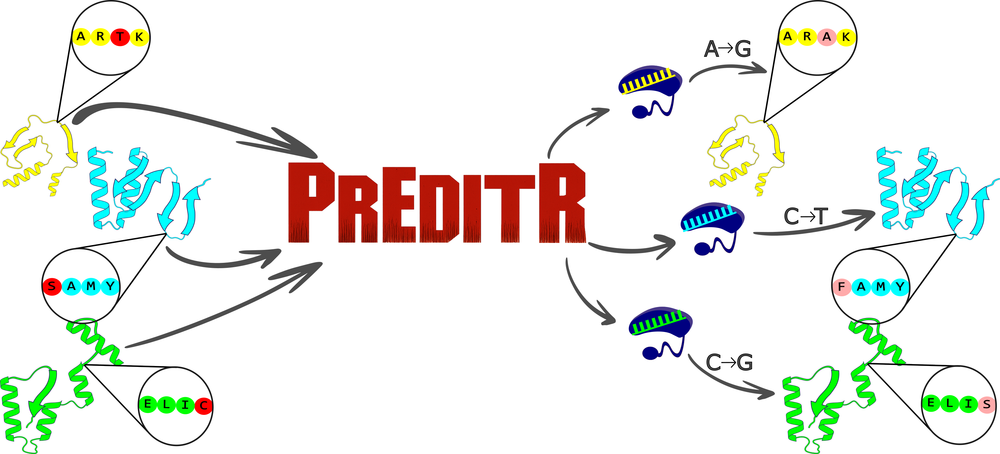

# PrEditR Documentation

## Table of Contents
- [About PrEditR](#about-preditr)
- [Understanding the Input](#understanding-the-input)
  - [General Parameters](#general-parameters)
  - [Off-Target Search Parameters](#off-target-search)
      - [Command Line Exclusive Parameters](#off-target-search-command-line-exclusive-parameterss)
      - [Shiny App Exclusive Parameters](#off-target-search-shiny-app-exclusive-parameterss)
      - [Download Indexed Genomes](#download-indexed-genomes)
  - [Defining Your Base Editors](#defining-your-base-editors)
  - [Defining Your Targets](#defining-your-targets)     
- [Understanding the Output](#understanding-the-output)
- [Command Line Version](#command-line-version)
- [Shiny App Version](#shiny-app-version)
  - [1. System Architecture](#1-system-architecture)
  - [2. Getting Started with Docker](#2-getting-started-with-docker)
  - [3. Running the PrEditR App](#3-running-the-preditr-app)
  - [4. Accessing PrEditR](#4-accessing-preditr)
  - [5. Managing PrEditR Containers](#5-managing-preditr-containers)
  - [6. Using the PrEditR Shiny App](#6-using-the-preditr-shiny-app)
    - [Setting Up Your Run](#setting-up-your-run)
    - [Running the Analysis](#running-the-analysis)
    - [Stopping and Cleaning Up](#stopping-and-cleaning-up)
- [Limitations](#limitations)
- [Troubleshooting and Reporting Issues](#reporting-issues)

## About PrEditR

PrEditR was developed by the [Myers Lab](https://www.samyerslab.org) at [La Jolla Institute for Immunology](https://www.lji.org) to support CRISPR sgRNA design using custom base editors. Originally created to streamline large-scale sgRNA design for protein post-translational modifications (PTMs) functional screens, PrEditR is a user-friendly tool for protein-centric base editing applications.

## Understanding the Input

##### General Parameters

* **--organism** [REQUIRED]: "human" or "mouse".
* **---job Name** [REQUIRED]: Provide a unique name for the analysis job, which will be used for naming the output files.
* **--threads** [OPTIONAL]: The threads parameter (int; default: 1) controls how many guides are designed in parallel. The tool requires a baseline of 4 GB RAM, plus 2–2.5 GB for each additional thread. Running via the Shiny app adds extra memory overhead compared to the command-line interface. For runs with fewer than 50 guides, 1–2 threads should be sufficient. Increase the number of threads only for larger runs if adequate RAM is available.
  
    > **Note:** If you're using Docker Desktop, be aware that it may not have access to all of your system's RAM due to default memory limits.
On *Windows*, you can adjust this limit in the .wslconfig file located at:
C:/Users/YourUsername/.wslconfig.
If this file doesn't exist, you can create one manually or use the sample provided in this repository. Open the file using the text editor, set the desired RAM limit, save the file to C:/Users/YourUsername/.wslconfig, and restart your computer for the changes to take effect. On *macOS*, open Docker Desktop, go to Settings (or Preferences) > Resources, adjust the Memory slider, and click Apply & Restart to apply the changes.

###### Command Line Exclusive Parameters

In addition to the parameters above, when running the application in command line mode, users can set the following parameters: 

* **--shiny** [OPTIONAL] (boolean; default: FALSE): Enables multisession mode. Useful only if running on a Windows machine. Multisession mode adds a significant overhead to the run, so it is discouraged.
* **--tmp** [REQUIRED]: Path to a directory to write temporary files to.

##### Off-Target Search Parameters

This section controls the search for potential off-target sites.

* **--off_targets** [OPTIONAL] (boolean; default: FALSE): Select `TRUE` to enable the search, or `FALSE` to disable it.
* **--n_mismatches** [OPTIONAL] (int; default: `3`): Instructs the tool to search for off-target sites with up to this number of differences from the guide's spacer sequence. A value of `3` will find off-targets with 0, 1, 2, and 3 mismatches.
* **--n_max_alignments** (int; default: `10`): Filters out promiscuous guides. Any designed guide with a number of perfect, zero-mismatch alignments to the genome greater than or equal to this value will be discarded.

###### Off-Target Search Command Line Exclusive Parameters
* **--indexed_genome** [REQUIRED IF OFF-TARGET SEARCH ON]: Path to the directory that contains the indexed genome files (in `.ebwt` format). NOTE: this is different for the Shiny app. See below.

###### Off-Target Search Shiny App Exclusive Parameters
* **Indexed Genome Directory**: This field is mandatory if `Perform Off-Target Search` is `TRUE`. The value must be the name of the subfolder (located within the directory mounted to `/data`) that contains the indexed genome files (in `.ebwt` format).
    > For example, if the host path `C:\Users\YourUser\PrEditR_IO` is mounted to `/data`, and the indexed genome is located in `C:\Users\YourUser\PrEditR_IO\hg38_index`, the value for this field should be `hg38_index`.

###### Download Indexed Genomes
The human indexed genome (hg38) is available for download [here](https://drive.google.com/file/d/14BxsBbPZK4ugSJ5dDBN04Y35I4KSULoz/view?usp=drive_link).
The mouse indexed genome (mm10) is available for download [here](https://drive.google.com/file/d/1KDcW5p5pOZIENVO0Pvurec4rijsCDPmp/view?usp=drive_link).
Alternatively, users can prepare their own indexed genomes using Bowtie (version 1). 

#### Defining Your Base Editors

A CSV file defining the properties of the base editors is a required input.

An editors template is provided in this repository. Alternatively, click the **Download Editors File Template** button on the Shiny app to obtain a pre-formatted CSV file. This file can be populated using any spreadsheet software or a text editor.

Each row in this file defines one editor. The following columns must be completed:

| Column Name       | Description                                                                                                                                              | Example |
| ----------------- | -------------------------------------------------------------------------------------------------------------------------------------------------------- | ------- |
| **name** | A unique name for the editor, used to link to targets.                                                                                                   | `ABE8e`   |
| **pam_sequence** | The Protospacer Adjacent Motif (PAM) sequence. Use 'N' for any nucleotide.                                                                               | `NGG`     |
| **spacer_length** | The length (in nucleotides) of the guide RNA's spacer sequence.                                                                                            | `20`      |
| **edit_type** | The specific base conversion the editor performs: adenine to guanine (`a2g`), cytosine to thymine (`c2t`), thymine to guanine (`t2g`), adenine to cytosine (`a2c`), ...                                               | `a2g`     |
| **edit_window_min** | The start of the editing window; the closest position to the PAM (excluding the PAM) where editing can occur. This must be a negative number. This assumes that the PAM sequence is located at 3' of the editing window.          | `-13`     |
| **edit_window_max** | The end of the editing window; the furthest position from the PAM where editing can occur. This must also be a negative number.                          | `-17`     |

#### Defining Your Targets

A CSV file describing the specific genomic targets for editing is also required.

An input template is provided in this repository. Alternatively, click the **Download Targets File Template** button on the Shiny app to get a correctly formatted file.

Each row in this file represents an independent editing task. The columns are described below:

| Column Name       | Description                                                                                                                                                                                          |
| ----------------- | ---------------------------------------------------------------------------------------------------------------------------------------------------------------------------------------------------- |
| **gene_symbol** | The official symbol for the target gene (e.g., `KRAS`). The `ensembl_id` may be left blank if this is provided.                                                                                       |
| **ensembl_id** | The [Ensembl](https://ensembl.org) transcript ID (e.g., `ENST00000256078`). Using a transcript ID is recommended for isoform precision. If only a gene symbol is provided, the tool will report results for the first transcript found containing the target amino acid at the specified position. > **Note**: Ensembl IDs are typically formatted as ID.version. Provide only the ID portion, excluding the dot and version number.|
| **target_aa** | The single-letter code for the target amino acid (e.g., `V` for Valine).                                                                                                                         |
| **target_position** | The numerical position of the target amino acid within the protein sequence.                                                                                                                       |
| **editor** | The name of the editor for this target. This name must match a `name` from the `editors.csv` file.                                                                                                     |
| **edit_type** | The type of edit (`a2g`, `c2t`, `c2g`, ...). This must match the `edit_type` defined for the chosen editor in the `editors.csv` file.                                                                            |

The targets file allows for flexibility:

* Rows can use either Ensembl IDs, gene symbols, or both.
* Different editors can be specified for different targets within the same run, provided each editor is defined in the editors file.

## Understanding the Output

PrEditR appends the following columns to the input: 

| Column Header | Explanation |
| :--- | :--- |
| `gene_strand` | Indicates the strand where the gene is located on, either **+** or **-**. |
| `protospacer_seq` | The sequence of the protospacer, which is the specific DNA sequence that the guide RNA is designed to bind to. |
| `percent_gc` | The percentage of Guanine (G) and Cytosine (C) bases within the protospacer sequence. GC-content can influence the stability of the guide RNA-DNA interaction. |
| `protospacer_strand` | The strand of the DNA (**+** or **-**) that the protospacer sequence is on. |
| `pam_seq` | The Protospacer Adjacent Motif (PAM) sequence. |
| `chromosome` | The chromosome where the target sequence is located. |
| `pam_coordinates` | The specific genomic coordinates of the PAM sequence. |
| `mutation_type` | The classification of the intended mutation (e.g., missense, nonsense, silent). |
| `wildtype_sequence` | Shows the original **wildtype** amino acid sequence, including 7 amino acids on each side of the edit site. The specific amino acids targeted for editing within the "edit window" are clearly identified by vertical bars. |
| `mutant_sequence` | Shows the resulting **mutant** amino acid sequence after the intended edit, also displaying the +/- 7 flanking amino acids for context. |
| `edit` | A concise summary of the amino acid change. For example, **S45P** signifies that the amino acid Serine (S) at position 45 is changed to Proline (P). |
| `Restriction Enzymes` | This column checks for the presence of recognition sites for a set of common restriction enzymes (**EcoRI, KpnI, BsmBI, BsaI, BbsI, PacI, MluI**) within the guide sequence. |
| `Off-Target Alignments` | This group of columns (`alignments_n0`, `alignments_n1`, `alignments_n2`, `alignments_n3`, etc.) quantifies the guide's specificity. Each column lists the total number of sites in the genome where the guide sequence aligns with a specific number of mismatches (e.g., `alignments_n0` is the count of perfect matches, `alignments_n1` is the count of sites with one mismatch, and so on). |

## Command Line Version

Users can pull the PrEditR image from https://hub.docker.com/r/fvasquezcastro/preditr. The parameters required to run PrEditR are explained in the [Understanding the Input](#understanding-the-input) section. Run `/home/PrEditR.R --help` in the Docker image for more details. A template for running the image on an HPC cluster with the SLURM job scheduler is provided in the repository.
**Note:** PrEditR is available for both amd64 and arm64 architectures. Ensure that you download a version that is compatible with your system. 

## Shiny App Version

This section details the setup and operation of the PrEditR Shiny app using the Docker Desktop graphical user interface (GUI).

### 1. System Architecture

The system's chip architecture must be identified to download the correct Docker image.

* **`amd64`** (also known as `x86-64`): This architecture is utilized by most desktop and laptop computers with Intel and AMD processors.
* **`arm64`** (also known as `AArch64`): This architecture is common in mobile devices and is now used in newer laptops, including Apple's M-series chips and some Windows devices with Snapdragon processors.

### 2. Getting Started with Docker

PrEditR is packaged in a Docker container for simplified execution on any system.

#### Step 1: Install Docker Desktop

If not already installed, download and install Docker Desktop from the official [Docker website](https://www.docker.com/products/docker-desktop/). It is available for Windows, Mac, and Linux. A system restart might be required after installation.

#### Step 2: Download the PrEditR Image using Docker Desktop

A Docker Hub account is not required to download the public PrEditR image.

1.  Open the Docker Desktop application.
2.  In the search bar at the top of the window, enter `fvasquezcastro/preditr` and press Enter.
3.  From the search results, select the `fvasquezcastro/preditr` image.
4.  On the right side of the screen is a **Tag** dropdown menu. The correct tag for the system's architecture must be selected:
    * `v1.0_amd64` for Intel/AMD systems.
    * `v1.0_arm64` for Apple M-series/Snapdragon systems.
5.  Two options are presented: **Pull** and **Run**.
    * **Pull**: Downloads the image to the local machine, where it is stored in the `Images` tab. This action makes the image permanently available for later use.
    * **Run**: Downloads the image and immediately starts the application. If this option is chosen without first pulling, the image is deleted when the Docker session is terminated.
6.  Click the **Pull** button to download the selected image version.

### 3. Running the PrEditR App

Once the image is downloaded, the application can be launched from Docker Desktop under the `Images` tab or from the search bar.

#### Understanding Images and Containers

Each time an image is run, Docker creates a new container. An **image** is the application template, while a **container** is a live, running instance of that image. All active and past containers are listed in the `Containers` tab in Docker Desktop.

#### Step 1: Launch the Container

1.  In Docker Desktop, navigate to the `Images` tab on the left-hand menu.
2.  Locate the `fvasquezcastro/preditr` image that was pulled. Click the **Run** button next to the image name.

#### Step 2: Configure Optional Settings

A dialog box will appear where settings must be configured before starting the container.

1.  Click on **Optional settings**.
2.  **Ports**: In the `Host Port` field, assign a port number for the application (e.g., `3838`).
3.  **Volumes**: A local directory must be connected to the container to save results.
    * In the `Host Path` field, use the `...` button to select a folder on the local computer where output files will be saved.
    * The `Container Path` must be set to `/data`.
4.  **Environment variables** can be left empty.

> **Note on Off-Target Searches:** If off-target analysis will be performed, a subfolder containing the indexed genome files must be created inside the chosen `Host Path` directory.

#### Step 3: Start the App

Click the blue **Run** button at the bottom of the configuration window to start the PrEditR container.

### 4. Accessing PrEditR

Open a web browser and navigate to the following address:

`http://127.0.0.1:<port_number>`

Replace `<port_number>` with the port specified in the settings (e.g., `http://127.0.0.1:3838`). The PrEditR Shiny app is now accessible.

### 5. Managing PrEditR Containers

#### Running Multiple Instances

Multiple instances of PrEditR can run simultaneously in different containers. To do this, return to the `Images` tab, click the **Run** button on the PrEditR image again, and assign a different `Host Port` (e.g., `3839`, `3840`) for the new container. Each instance will be listed as a separate entry in the `Containers` tab.

### 6. Using the PrEditR Shiny App

This section describes the parameters and input files required to run an analysis in PrEditR.

#### Setting Up Your Run

The application's homepage contains several parameters to configure for an analysis.

#### Running the Analysis

Check the [Understanding the Input](#understanding-the-input) section.

After all parameters are set and files are uploaded:

1.  Click the blue **Run Batch** button.
2.  An animated progress bar will indicate that the analysis is in progress. The analysis duration depends on the job size.
3.  Upon completion, a pop-up window will appear:
    * A **success message** indicates that the run finished correctly. Output files will be located in the local directory that was bound as a volume.
    * An **error message** indicates that the run failed. This is commonly caused by insufficient memory (RAM). If this occurs, reduce the number of `Threads` and run the analysis again.
  
**IMPORTANT:** PrEditR takes a while loading resources but once the run started, it progresses rapidly. To maximize efficiency, batch your sgRNA designs into as few runs as possible. 
  
#### Stopping and Cleaning Up

Closing the browser tab does not terminate the container, which continues to run in the background and consume system resources. To shut down the application:

1.  Navigate to the `Containers` tab in Docker Desktop.
2.  Find the container running the PrEditR instance, identified by the image name and port number.
3.  Click the **stop button** to halt the application.
4.  To remove the stopped container, click the **delete button**. This action deletes the container instance, but the pulled image is preserved in the `Images` tab for future use.

## Limitations

1. PrEditR assumes that each base editor performs a single type of nucleotide transition (e.g., A>G, C>T, C>G, …). For editors capable of multiple conversion types, a workaround is to define them as separate editor entries—one for each distinct conversion.
2. RNA base editors are not supported.
3. PAM sequences are assumed to lie immediately downstream (3') of the protospacer. 
4. All protospacers designed in a single run must be of the same length. While PrEditR supports variable protospacer lengths in general, mixed-length designs cannot be combined in a single execution.
5. PrEditR assumes uniform editing efficiency across all positions within the defined editing window; position-specific editing probabilities (i.e., weighted editing windows) are currently not supported.
6. While the command-line version uses forking for child processes—speeding up processing and reducing RAM usage—the Shiny app relies on multisession mode, which significantly increases memory consumption and leads to slower performance.

## Reporting Issues

If you encounter problems while setting up or running `PrEditR`—including issues with inputs, outputs, or general execution—we encourage you to report them using the **Issues** tab on this repository.

For more complex errors, especially those involving rows labeled as `"Unexpected error"` in the output, please re-run `PrEditR` in debugging mode to help us diagnose the issue more effectively.

### Enabling Debug Mode

#### Command-Line Interface

To enable debug mode in the CLI version, set the environment variable `PREDITR_DEBUG=TRUE` inside the container. You can refer to the provided SLURM template for an example of how to do this.

#### Shiny App

When running the Shiny app:

* Start a new container as usual.
* Set the port and bind volume as before.
* **Important**: Do not leave the environment variables section empty.
* Add a new environment variable:
    * **Name**: `PREDITR_DEBUG`
    * **Value**: `TRUE`

Debug mode will generate a stack trace file (`.rda`) in the container’s temporary directory.

### Submitting Error Logs

You can send the resulting `.rda` file to us at [preditr@lji.org](mailto:preditr@lji.org) for further assistance.