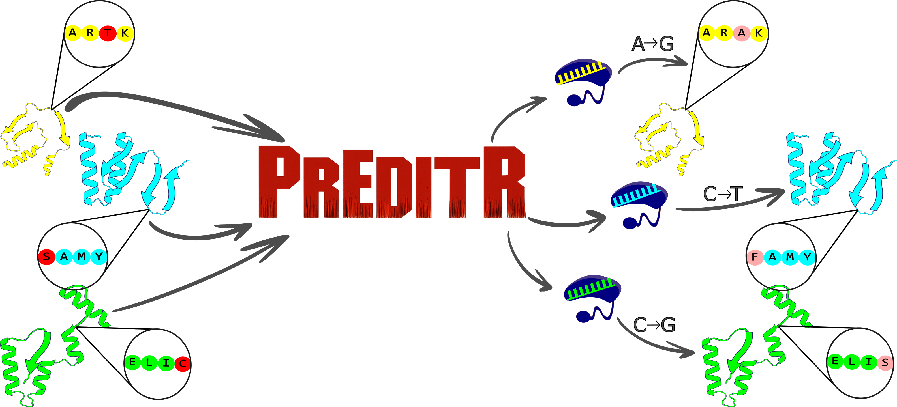

# PrEditR Documentation

## Table of Contents
- [About PrEditR](#about-preditr)
- [Understanding the Input](#understanding-the-input)
  - [General Parameters](#general-parameters)
  - [Off-Target Search Parameters](#off-target-search)
  - [Defining Your Base Editors](#defining-your-base-editors)
  - [Defining Your Targets](#defining-your-targets)      
- [Understanding the Output](#understanding-the-output)
- [Command Line Version](#command-line-version)
- [Shiny App Version](#shiny-app-version)
  - [1. System Architecture](#1-system-architecture)
  - [2. Getting Started with Docker](#2-getting-started-with-docker)
  - [3. Running the PrEditR App](#3-running-the-preditr-app)
  - [4. Accessing PrEditR](#4-accessing-preditr)
  - [5. Managing PrEditR Containers](#5-managing-preditr-containers)
  - [6. Using the PrEditR Shiny App](#6-using-the-preditr-shiny-app)
- [Limitations](#limitations)
- [Reporting Issues](#reporting-issues)

---

## About PrEditR



PrEditR was developed by the [Myers Lab](https://www.samyerslab.org) at [La Jolla Institute for Immunology](https://www.lji.org) to support CRISPR sgRNA design using custom base editors. Originally created to streamline large-scale sgRNA design for protein post-translational modifications (PTMs) functional screens, PrEditR is a user-friendly tool for protein-centric base editing applications.

---

## Understanding the Input

### General Parameters

* **--input** [REQUIRED]: Path to the targets input file.
* **--output** [REQUIRED]: Path to the output directory.
* **--organism** [REQUIRED]: "human" or "mouse".
* **--job Name** [REQUIRED]: Provide a unique name for the analysis job, which will be used for naming the output files.
* **--threads** [OPTIONAL]: The threads parameter (int; default: 1) controls how many guides are designed in parallel. The tool requires a baseline of 1.5 GB RAM, plus 1.5 GB for each additional thread.

### Off-Target Search Parameters

* **--off_targets** [OPTIONAL] (boolean; default: FALSE): Select `TRUE` to enable the search.
* **--n_mismatches** [OPTIONAL] (int; default: `3`): Instructs the tool to search for off-target sites with up to this number of differences.
* **--n_max_alignments** (int; default: `10`): Filters out promiscuous guides. Any guide with a number of perfect, zero-mismatch alignments to the genome $\ge$ this value will be discarded.

#### Control Guides

* **--non_editing_controls** [OPTIONAL] (boolean; default: FALSE): Select `TRUE` to enable the search of non-editing controls for each gene in the input.

### Defining Your Base Editors

| Column Name | Description | Example |
| :--- | :--- | :--- |
| **name** | A unique name for the editor, used to link to targets. | `ABE8e` |
| **pam_sequence** | The Protospacer Adjacent Motif (PAM) sequence. Use 'N' for any nucleotide. | `NGG` |
| **spacer_length** | The length (in nucleotides) of the guide RNA's spacer sequence. | `20` |
| **edit_type** | The specific base conversion the editor performs (e.g., `a2g`, `c2t`). | `a2g` |
| **edit_window_min** | The start of the editing window; closest position to the PAM (must be negative). | `-13` |
| **edit_window_max** | The end of the editing window; furthest position from the PAM (must be negative). | `-17` |

### Defining Your Targets

**Note:** Either a **UniProt ID** or an **Ensembl ID** is **REQUIRED**. Providing a gene symbol alone is not sufficient.

| Column Name | Description |
| :--- | :--- |
| **uniprot_id** | The UniProt Accession ID (e.g., `P01116`). |
| **ensembl_id** | The Ensembl transcript ID (e.g., `ENST00000256078`). Highly recommended for isoform precision. |
| **gene_symbol** | The official symbol for the target gene (e.g., `KRAS`). |
| **target_aa** | The single-letter code for the target amino acid (e.g., `V`). |
| **target_position** | The numerical position of the target amino acid within the protein sequence. |
| **editor** | The name of the editor for this target (must match `name` from `editors.csv`). |
| **edit_type** | The type of edit (must match `edit_type` defined for the chosen editor in `editors.csv`). |

---

## Understanding the Output

PrEditR appends the following columns to the input:

| Column Header | Explanation |
| :--- | :--- |
| `gene_strand` | Indicates the strand where the gene is located on, either **+** or **-**. |
| `protospacer_seq` | The specific DNA sequence that the guide RNA is designed to bind to. |
| `percent_gc` | The percentage of G and C bases within the protospacer sequence. |
| `protospacer_strand` | The strand of the DNA (**+** or **-**) that the protospacer sequence is on. |
| `pam_seq` | The Protospacer Adjacent Motif (PAM) sequence. |
| `chromosome` | The chromosome where the target sequence is located. |
| `pam_coordinates` | The specific genomic coordinates of the PAM sequence. |
| `mutation_type` | Classification of the intended mutation (e.g., missense, nonsense, silent). |
| `wildtype_sequence` | Original amino acid sequence (+/- 7 AA). Target sites are identified by vertical bars. |
| `mutant_sequence` | Resulting mutant amino acid sequence after the intended edit (+/- 7 AA). |
| `edit` | Concise summary of the amino acid change (e.g., **S45P**). |
| `Restriction Enzymes` | Checks for recognition sites of **EcoRI, KpnI, BsmBI, BsaI, BbsI, PacI, MluI**. |
| `Off-Target Alignments` | Quantifies specificity via `alignments_n0` through `alignments_n3`. |
| `error` | Provides detailed reasons for rows that failed to generate a guide. |
| `warning` | Provides non-fatal warnings regarding the design or database mapping. |

---

## Running in Command Line Mode

Users can pull the PrEditR image from [Docker Hub](https://hub.docker.com/r/fvasquezcastro/preditr). Ensure you download the version compatible with your architecture (`amd64` or `arm64`). Run `/home/PrEditR.R --help` in the Docker image for more details. 

### Running via Singularity

Below is a template for executing PrEditR in CLI mode using Singularity/Apptainer. Be sure to replace the placeholder variables with the actual paths on your system:

```bash
IMAGE_PATH=/path/to/images/preditr_image.sif
INPUT_PATH=/path/to/input/targets_input.csv
EDITOR_PATH=/path/to/input/editors.csv
INDEXED_GENOME_PATH=/path/to/genome/hg38_genome_index
OUTPUT_PATH=/path/to/output_directory
TEMPORARY_PATH=/path/to/temp_scratch
ORGANISM=human #human or mouse

singularity exec \
  --no-home \
  --env PREDITR_MODE=CLI \
  --pwd /app \
  --bind $INPUT_PATH:$INPUT_PATH,$EDITOR_PATH:$EDITOR_PATH,$INDEXED_GENOME_PATH:$INDEXED_GENOME_PATH,$OUTPUT_PATH:$OUTPUT_PATH,$TEMPORARY_PATH:$TEMPORARY_PATH \
  $IMAGE_PATH /app/PrEditR.R \
    --job_name your_analysis_job \
    --input $INPUT_PATH \
    --output $OUTPUT_PATH \
    --editors $EDITOR_PATH \
    --off_targets FALSE \
    --indexed_genome $INDEXED_GENOME_PATH \
    --organism $ORGANISM \
    --threads 30 \
    --tmp $TEMPORARY_PATH \
    --non_editing_controls FALSE
```

---

## Running the Shiny App

### 1. System Architecture
Identify your chip architecture to download the correct Docker image:
* **`amd64`**: Intel and AMD processors.
* **`arm64`**: Apple M-series chips and Snapdragon processors.

### 2. Getting Started with Docker
1. **Install Docker Desktop**: Download from the official [Docker website](https://www.docker.com/products/docker-desktop/).
2. **Download Image**: Search for `fvasquezcastro/preditr` in the Docker Desktop search bar.
3. **Select Tag**: Select `v1.0_amd64` for Intel/AMD or `v1.0_arm64` for Apple/Snapdragon.
4. **Pull**: Click the **Pull** button to save the image locally.

### 3. Running the PrEditR App
1. **Launch**: In the `Images` tab, click **Run** next to the PrEditR image.
2. **Ports**: In `Optional settings`, assign a `Host Port` (e.g., `3838`).
3. **Volumes**: 
    * `Host Path`: Select your local folder for saving results.
    * `Container Path`: Must be set to `/data`.
4. **Start**: Click the blue **Run** button.

### 4. Accessing PrEditR
Open a browser and navigate to: `http://127.0.0.1:3838`.

### 5. Using the PrEditR Shiny App
* **Run Analysis**: Upload your files and click **Run Batch**.
* **Success/Error**: Check the status pop-up. If an error occurs, it is often due to insufficient RAM; try reducing the number of `Threads`.
* **Cleanup**: Stop and delete the container in the `Containers` tab when finished to free system resources.

---

## Limitations

1. **Single Transition**: PrEditR assumes that each base editor performs a single type of nucleotide mutation (e.g., A-to-G, C-to-T, C-to-G, …). For editors capable of multiple conversion types, define them as separate editor entries—one for each distinct conversion.
2. **DNA Only**: Only DNA base editors are supported; RNA base editors are not.
3. **PAM Orientation**: PAM sequences are assumed to lie immediately downstream (i.e., 3') of the protospacer.
4. **Uniform Length**: All protospacers designed in a single run must be of the same length. Mixed-length designs cannot be combined in a single execution.
5. **Efficiency**: PrEditR assumes uniform editing efficiency across all positions within the editing window; position-specific weighted editing windows are not supported.
6. **Built-in Genome Annotations**: The tool includes specific human (hg38) and mouse (mm10) versions. Local UniProt-to-Ensembl maps were constructed using data from Ensembl.org (Nov 25, 2025). Users can access raw data at `/app/maps/<organism>` in the image.
7. **Database Mapping**: Mapping relies on internal databases. For associations identified after November 25, 2026, the database might fail to find an Ensembl transcript ID when provided only a UniProt ID. Providing the Ensembl transcript ID directly will circumvent this error.

---

## Reporting Issues

If you encounter problems while setting up or running `PrEditR`, please report them using the **Issues** tab on this repository. Use the `error` and `warning` columns in your output files for troubleshooting.
